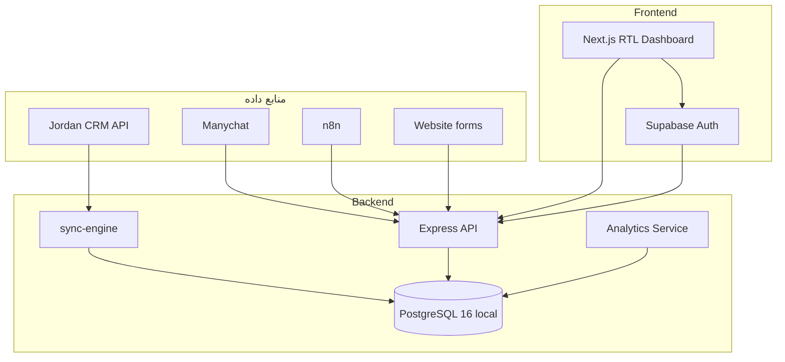

# معماری — کلینیک جردن Dashboard

> این سند منبع حقیقت فنی است. هر تغییر معماری باید اینجا به‌روز شود.

## نمای کلی



## اصول طراحی

1. **Analytics جدا از CRUD** — مسیرهای `/api/analytics/*` فقط aggregate می‌خوانند؛ mutate در لایه sync/leads.
2. **CRM منبع حقیقت بالینی** — conflict policy: `crm_wins` (قابل تغییر در `ConflictResolver`).
3. **PII رمزنگاری‌شده در rest** — فیلدهای حساس با پسوند `_enc` در DB؛ decrypt فقط در لایه سرویس با مجوز.
4. **RTL-first UI** — `dir="rtl"` در root؛ sidebar سمت راست؛ جداول و نمودارها RTL-aware.
5. **مستندات قبل از کد** — schema و API contract در `packages/shared` با Zod.

## Monorepo

| Package | مسئولیت |
|---------|---------|
| `@jordan/db` | Prisma client + schema |
| `@jordan/shared` | Zod types/schemas |
| `@jordan/sync-engine` | CRM sync pipeline |
| `@jordan/api` | HTTP API, auth, analytics |
| `@jordan/web` | Dashboard UI |

## Sync Pipeline

```
Apilogin → JWT
  → GET entity endpoint
  → Zod validate (MappingEngine)
  → encrypt PII fields
  → upsert Prisma
  → SyncLog (STARTED → SUCCESS|PARTIAL|FAILED)
```

Cron: `SYNC_CRON_SCHEDULE` (پیش‌فرض هر ۶ ساعت).  
Manual: `POST /api/sync/run` (نیاز به auth + audit log).

## Lead Pipeline

| منبع | ورودی |
|--------|--------|
| Instagram | Manychat → webhook |
| WhatsApp | n8n → webhook |
| Site | n8n / form → webhook |
| Manual | `POST /api/leads` |

Webhook header: `x-webhook-secret: LEAD_WEBHOOK_SECRET`

## فاز بعدی (ثبت شده، پیاده‌سازی نشده)

- Task management بین کاربران
- گزارش‌گیری scheduled
- Revenue aggregation از Treatment + Service tariff
